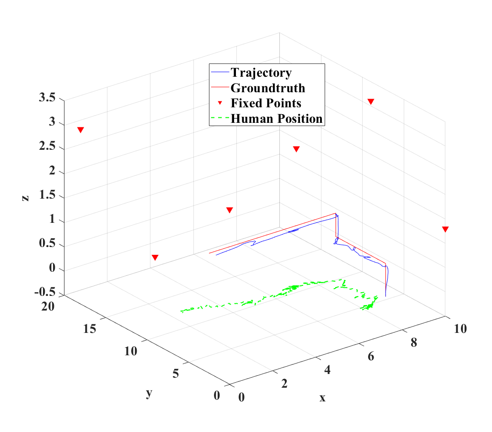
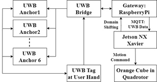

# DUWN_T-SE-RB-GRU_UAV  
*A Transformer-SE-Residual-BiGRU Model for Gesture Recognition via Distributed UWB Network to Control UAVs*

  
*Figure 1: Model Architecture*

---

## 📘 Overview

**DUWN_T-SE-RB-GRU_UAV** is a deep learning framework designed to perform **gesture recognition** using signals captured by a **Distributed Ultra-Wideband (UWB) Network**, enabling **real-time UAV control**. The system leverages a hybrid architecture combining **Transformer**, **Squeeze-and-Excitation (SE)** modules, **Residual connections**, and a **Bidirectional GRU (BiGRU)** to enhance temporal and spatial signal understanding.

It supports:
- Model **training and testing**
- Real-time **inference on PC**
- Optimized **inference on Jetson Xavier NX**
- Full UAV flight control via **Jetson-based inference**

---

## 🧠 Acronym Breakdown

- **DUWN**: Distributed Ultra-Wideband Network  
- **T-SE**: Transformer with Squeeze-and-Excitation  
- **R**: Residual  
- **B**: Bidirectional
- **GRU**: Gated Recurrent Unit  
- **UAV**: Unmanned Aerial Vehicle

---

## 📂 Repository Contents

| Folder | Description |
|--------|-------------|
| `res-bi-gru-ablation-multisequence.py` | Scripts for model training and evaluation |
| `inference2.5.py` | Inference code runnable on standard PC |
| `inference-nocamera3-jetson.py` | Inference code optimized for Jetson NX |
| `fly_NX3.py` | Jetson NX code integrated with UAV flight commands |
| `dataset3.zip` | Training datasets |
| `test1.zip` | Testing datasets |

---

## 🔧 Installation & Setup

**Requirements:**
- Python ≥ 3.8
- tensorflow = 2.10.1
- NumPy, OpenCV, etc.
- Jetson Xavier NX with JetPack SDK (for deployment)

## 🧪 Results

  
*Figure 2: UAV flight path based on gesture input*

---

## 🖼️ System Architecture

  
*Figure 3: Distributed UWB Network and UAV control setup*

---

## 📊 Dataset

Both training and testing datasets are included :
- Collected from multiple UWB anchors and a wearable tag  
- Includes labeled gesture sequences  
- Preprocessed for training
- `inference2.5.py` is used for data collection

---

## 🔬 Model Details

- **Transformer**: Extracts global dependencies from sequential UWB features  
- **SE blocks**: Recalibrate feature maps based on inter-channel relations  
- **Residual blocks**: Ensure deeper network training stability  
- **BiGRU**: Captures bidirectional temporal dynamics

---

## 📚 References & Related Work

- TBA

---

## 👤 Author

**Your Name**  
- GitHub: [@Felixgun](https://github.com/Felixgun)  
- Email: felix.iniemail@yahoo.com  
- LinkedIn: [https://linkedin.com/in/felixg26/](https://linkedin.com/in/felixg26/)

---
